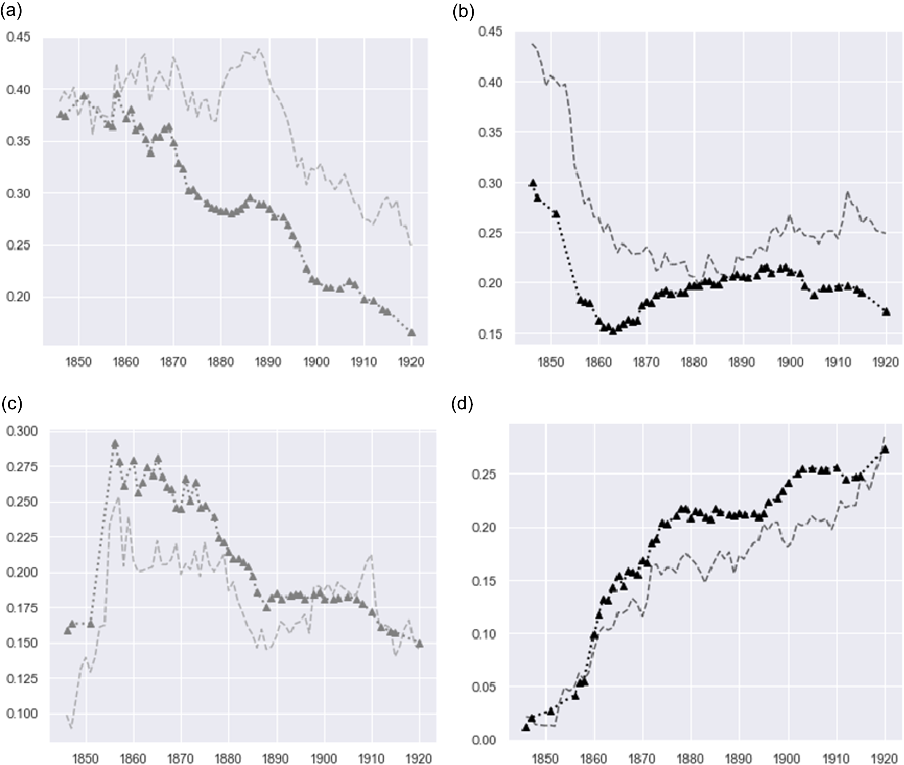

# Whose News?

This Repository contains supplementary information and code for the Open Access article ‘[Whose News? Critical Methods for Assessing Bias in Large Historical Datasets](https://doi.org/10.1017/chr.2025.10007)’. 

Below is a short summary of the article containing links to relevant work and data, which is followed by a longer 'blogpost' which provides a summary of the research.

Please contact us with any questions or suggestions. We would be delighted to hear from anyone making use of the accompanying datasets we are also publishing.

`Kaspar Beelen, Jon Lawrence, Katherine McDonough, and Daniel C. S. Wilson. ‘Whose News? Critical Methods for Assessing Bias in Large Historical Datasets’. Computational Humanities Research 1 (2025).

---
### !! Stop Press!!

We are delighted to share our article '[Whose News](https://doi.org/10.1017/chr.2025.10007)?', which appears in the first volume of *[Computational Humanities Research](https://www.cambridge.org/core/journals/computational-humanities-research)* -- the new journal which emerges from the community centring on the annual [CHR conference](https://computational-humanities-research.org/). We are especially pleased to be publishing in this interdisciplinary venue because the work underlying this article developed in the course of engaging with –  and also being inspired and influenced by – work presented at [CHR](https://computational-humanities-research.org/), as well as other venues in [DH](https://adho.org/), in historical studies, and especially in [newspaper and periodicals research](https://rs4vp.org/). The work behind this article began under the *[Living with Machines](https://livingwithmachines.ac.uk/)* project, whose efforts to [digitise, structure and publish](https://doi.org/10.23636/pbq5-9k28) *Mitchell's Newspaper Press Directories* represent a key milestone in the history of research with and about British newspaper collections. This article builds on our [previous work](https://doi.org/10.1093/llc/fqac037) which made initial use of *Mitchell's*, and goes further by including newspaper '[full text](https://github.com/Living-with-machines/newswords)' content into the analysis we describe as an 'Environmental Scan'. Here, we employ a series of measures in order to compare the *content* of nineteenth-century British newspapers with newly published and highly granular *descriptive metadata* about those titles derived from *Mitchell's*. This permits us to evaluate not only the accuracy of that metadata but also to build a more complete understanding of the composition, gaps, and lacunae of the British Library's newspaper collections. These newspapers were and remain social texts, with particular political affiliations and price-points. As such, they always spoke to and for particular readerships. When analysing these texts computationally it remains as important as ever to ask, 'Whose News' we are reading.

---

### Whose News? A blogpost.

When a researcher, a student or member of the public attempts to search a large historical dataset, perhaps making use of an interface provided by a library (or commercial provider), how can they tell what their results represent? Are twenty 'hits' a lot? Or a thousand? How many should you expect? The answer depends on how many documents, and what types, were included in the collection being searched. But perhaps the keyword had a specific political meaning? And what if the documents being searched rarely published that word because they opposed the perspective it implied? Or perhaps the publications where it tended to appear at the time have not yet been digitised? Or, if they have been, perhaps the OCR is systematically worse for some reason, causing that word to be obscured and effectively invisible?

Where humanistic researchers have wrestled with such questions they have tended to rely on their instincts or training in source criticism to evaluate the meaning of their findings: are they representative of the thing being investigated? But what happens when, as at present, search for and within documents happens 'at scale' using opaque digital tools? Traditional methods of source criticism do not have purchase in such an environment, which can become yet more problematic when the interfaces we rely upon give the impression of comprehensiveness, where none exists.

Our article '[Whose News](https://doi.org/10.1017/chr.2025.10007)' showcases an approach we call the *Environmental Scan*, which sets out to identify and explore biases in large historical datasets. The principle is a general one, which we illustrate with reference to the British Library's collection of digitised newspapers. We are able to do this by accessing public domain parts of the collection directly, outside of the platforms offered by commercial data providers. In the article, we make use of new and enriched historical metadata in order to put the main digitised collection into greater context, including by estimating its gaps and lacunae. We are thus able to examine nineteenth-century newspapers and identify which political viewpoints are over- or under-represented in the digitised collections available on different platforms.

Early digitisation initiatives targeted overtly political newspapers (e.g., Conservative and Liberal), with less emphasis on the Neutral or Independent press, but this trend shifted in later phases of digitisation, conducted by different organisations with different priorities. The 'Environmental Scan' makes it possible at last to see how digitised newspaper collections *in fact* relate to what was printed (in this case) in nineteenth century Britain. 

Once we are able to quantify these attributes of the collection, we can compare them to the actual language being used in newspaper titles. This allows us to gauge the extent to which 'typically' Liberal or Conservative titles were preoccupied with particular topics as a function of their political orientation. We apply this method to one of the biggest and perhaps most significant historical datasets yet created: *The British Newspaper Archive* (BNA). This dataset is in a constant state of flux, growing at a remarkable speed: to date, it contains over 92 million pages of historical newspapers, or about 150 billion words. Yet it still represents less than 20% of the newspapers held at the British Library, which has one of the largest collections of print newspapers in the world.

The provenance of the digitised collection served up to subscribers to *The British Newspaper Archive* website is thus a highly complex and partial assemblage resulting from layers of inscrutable editorial and commercial decisions stretching back decades; and yet, there is a risk its users mistake this offering as representative of all contemporary viewpoints, a risk which is likely to be exacerbated with the use of algorithmic and data-driven approaches to the collection, as these become more readily available, e.g., in the form of AI-powered search and analysis tools.

Before being able to quantify empirically which viewpoints are potentially missing from large collections, we set out three forms of 'bias' which may be significant for newspaper researchers to consider:

    1. **Bias-as-missingness**. This involves gaps in the data due to under-digitisation, in relation to the printed corpus 'out there'.

    2. **Bias-as-divergence**. This involves the implications of missingness in terms of 'representativeness': which voices tend to be over- or under-sampled in the digitised corpus as a result?

    3. **Bias-as-partisanship**. This involves the political bias implicit in the data itself.

This typology is far from exhaustive but suggests concrete ways that missingness shapes collections, and risks producing datasets that are skewed in their composition and partisan in their content. Our goal in the article is to suggest a method for consiering ways that missing data can influence our analysis and findings as researchers.

We use the descriptions of newspaper titles given by nineteenth-century reference works (*Mitchell's*) to provide a measure of what we might *expect* the collection to look like, and in the plot below we show the ways in which it in fact diverges from this expectation. Although we do not take *Mitchell's* to be a form of ground truth, it nonetheless offers an informative point of comparison which has not previously been used to assess the collection.

This figure shows the proportion of newspapers by political leaning included in the BNA as compared to the proportions expected based on data from the press directories. Dashed lines show the proportional presence of each leaning in the sample (BNA), while the dotted line represents the population (press directories). The top-left figure shows trends for Liberal newspapers (grey); the top-right Conservative newspapers (black). The bottom-left figure shows Neutral newspapers (grey); the bottom-right Independent titles (black).

---

The principal contribution of the article is, therefore, to harness different types of metadata as diagnostic tools for gauging latent imbalances and biases in the collection. Our approach in this respect represents a multidisciplinary effort combining historical understanding of how newspaper collections were created, with statistical measures to gauge and analyse hidden biases. This requires broadening traditional notions of metadata as collected in library catalogues to incorporate terminologies and classifications gathered from contemporary (nineteenth-century) reference works. We propose a method that combines well-known types of descriptive metadata (e.g., titles and dates of publication) and administrative metadata (related to digitisation or digital formatting) with a new level of information that we term contemporary ***reference metadata***. This is metadata that:

    • has its origins outside the object of inquiry and is derived from a reference publication;

    • provides contextual information in the language of past actors;

    • sheds light on how the dataset represents only a sample from a wider potentially unpreserved population.

The principles behind the Environmental Scan could be applied to any big data collection where researchers are able to secure open access to reference metadata, or contextual information rich enough to shed light on its hidden biases. With historical big data, we argue that the key is to identify, digitise, and structure high-quality information collated at the time of data creation. 

Whereas few scholars would dispute that individual newspapers offer an 'oligoptic' i.e., 'partial' view of society, we insist that this is also true of any digital newspaper collection as a whole and, indeed, of newspapers as a genre. Although data providers like to deploy metaphors to suggest that their collections provide a window or mirror through which we can see past society, in practice, they necessarily offer partial perspectives shaped by the worldview of editors, advertisers, and influential readers. The strong bias towards partisan newspapers in early digitisation efforts almost certainly represents an unintended consequence of the curators’ laudable aim to prioritise the selection of long-run, 'serious' newspapers from different regions; however, this feature of the collection has impacts on today's researchers reliant on search and discovery tools that obscure this important characteristic of the material being analysed.

Our aim, therefore, is to showcase one way to 'scale-up' the conventional techniques of source criticism in order to map the vast new collections of data, containing billions of words, that are themselves reshaping scholarship. We hope that by developing such critical awareness of digital archives and their construction as evidence we can help avoid the pitfalls of drawing mistaken conclusions when using digital tools.

